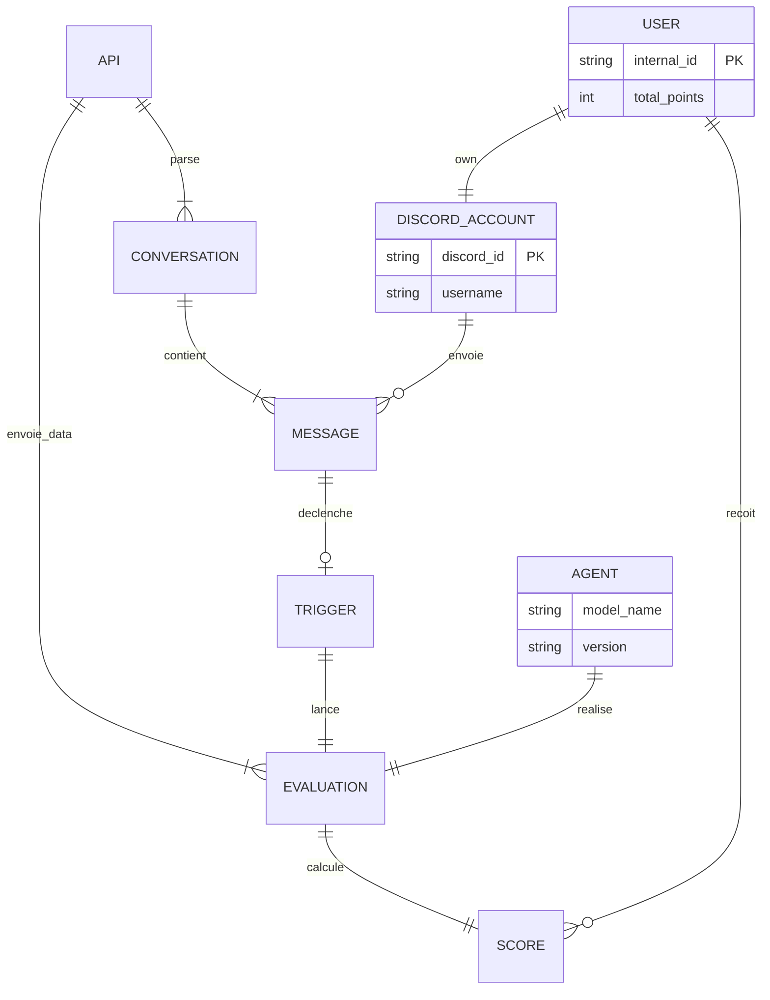

## Elements à prendre en compte

Trigger merci en français et en anglais + liste de synonyme & formulation
Délimitation de l'historique des conversations discord -> bien définir les id helper&beneficiary 
-> recherche de mots clés possibles tels que : problèmes, comment, pourquoi, besoin d'aide, ... (fr et eng)

