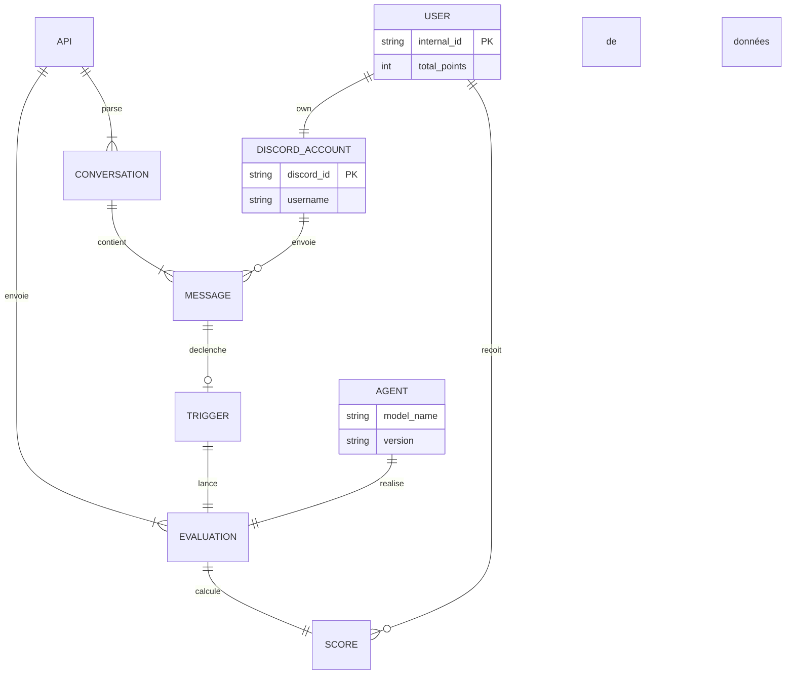

```mermaid
erDiagram
    %% Entités principales
    USER {
        string internal_id PK
        int total_points
    }
    
    DISCORD_ACCOUNT {
        string discord_id PK
        string username
    }

    AGENT {
        string model_name
        string version
    }

    %% Le Flux de conversation
    CONVERSATION ||--|{ MESSAGE : contient
    DISCORD_ACCOUNT ||--o{ MESSAGE : envoie

    %% Le service back end
    API ||--|{ CONVERSATION : parse
    API ||--|{ EVALUATION : envoie de données
    
    %% Le Trigger
    MESSAGE ||--o| TRIGGER : declenche
    TRIGGER ||--|| EVALUATION : lance

    %% L'Evaluation
    AGENT ||--|| EVALUATION : realise
    EVALUATION ||--|| SCORE : calcule

    %% La liaison finale et stockage
    USER ||--|| DISCORD_ACCOUNT : own
    USER ||--o{ SCORE : recoit
```

