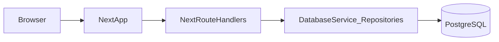
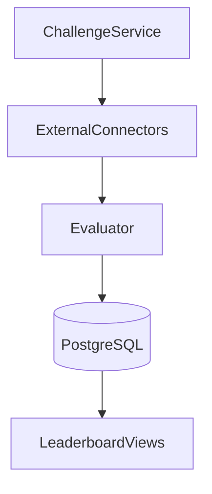

# Architecture

## High-level view

This repository is a monorepo composed of:

- **Apps**
  - `apps/leaderboard-client`: Next.js UI + Next Route Handlers
  - `apps/admin`: legacy static admin UI (optional)
- **Packages**
  - `packages/database-service`: Postgres schema + repositories (Drizzle)
  - `packages/config`: environment validation and config
  - `packages/evaluator`: AI evaluation pipeline (optional)
  - `packages/connectors`: GitHub / Google Drive connectors (optional)
  - `packages/services`: orchestration services (optional)
  - `packages/api`: Express REST API (optional)

## Data flow (UI-only dev setup)

In the default local setup described in the top-level `README.md`, the Next.js app:

- connects to **PostgreSQL** via `packages/database-service`
- uses `packages/config` for validated environment configuration
- implements **JWT cookie auth** via Next Route Handlers under `apps/leaderboard-client/src/app/api/auth`

## Optional evaluation pipeline

When using connectors + evaluator, the conceptual pipeline looks like:

Notes:

- The evaluator uses scoring **grids** (e.g. code/model/dataset/docs) and can store evaluation artifacts on contributions.
- Connectors fetch raw context (commits, meeting notes, etc.). The specific wiring depends on which tools you run.

