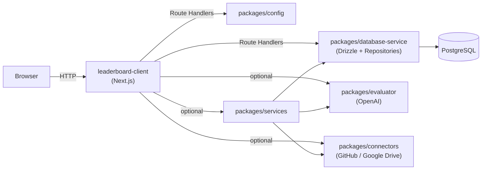
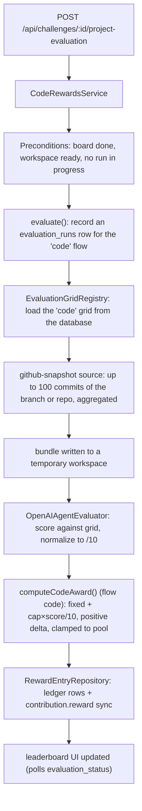
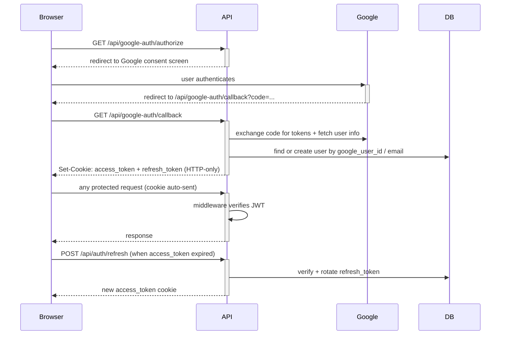
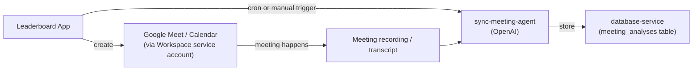

# Architecture

## Repository layout

This is a monorepo managed with npm workspaces. It has two top-level zones:

- **`apps/`** — deployable applications
- **`packages/`** — shared libraries consumed by apps and each other

```
leaderboard/
├── apps/
│   └── leaderboard-client/   ← Next.js app (the only deployed app)
└── packages/
    ├── config/               ← env validation + encrypted credentials (required by all)
    ├── database-service/     ← Drizzle ORM + repositories (required by all)
    ├── evaluator/            ← AI scoring pipeline (optional)
    ├── connectors/           ← GitHub / Kaggle / Google Drive / Slack (optional)
    ├── services/             ← orchestration logic (optional)
    ├── provisioner/          ← branch + GPU instance provisioning (optional)
    ├── scaleway/             ← Scaleway Instances API client (optional)
    ├── sync-meeting-agent/   ← meeting AI analysis (optional)
    ├── slack-signal-agent/   ← Slack signal detection (optional)
    └── test/                 ← ad-hoc test scripts
```

## How the pieces connect

The Next.js app is the single entry point for both the UI and the server-side logic. There is no separate API server — everything runs inside Next.js Route Handlers.


```mermaid
flowchart LR
  Browser -->|HTTP| NextApp["leaderboard-client\n(Next.js)"]
  NextApp -->|Route Handlers| Config["packages/config"]
  NextApp -->|Route Handlers| DB["packages/database-service\n(Drizzle + Repositories)"]
  DB --> Postgres[(PostgreSQL)]
  NextApp -->|optional| Services["packages/services"]
  NextApp -->|optional| Evaluator["packages/evaluator\n(OpenAI)"]
  NextApp -->|optional| Connectors["packages/connectors\n(GitHub / Google Drive)"]
  Services --> Evaluator
  Services --> Connectors
  Services --> DB
```

**Required at runtime:** `config` + `database-service`
**Optional (need API keys or a connected account):** `evaluator`, `connectors`, `services`, `provisioner`, `scaleway`, `sync-meeting-agent`, `slack-signal-agent`

## Data flow — code project evaluation pipeline

Evaluation is **project-scoped**: a contributor's personal task board is purely organizational and never scored directly. Once all of a contributor's tasks are `done` and their workspace is ready, they trigger one evaluation of their whole delivery.


```mermaid
flowchart TD
  A["POST /api/challenges/:id/project-evaluation"] --> B["CodeRewardsService"]
  B --> C["Preconditions: board done, workspace ready, no run in progress"]
  C --> D["evaluate(): record an evaluation_runs row for the 'code' flow"]
  D --> E["EvaluationGridRegistry: load the 'code' grid from the database"]
  E --> F["github-snapshot source: up to 100 commits of the branch or repo, aggregated"]
  F --> G["bundle written to a temporary workspace"]
  G --> H["OpenAIAgentEvaluator: score against grid, normalize to /10"]
  H --> I["computeCodeAward() (flow code): fixed + cap×score/10, positive delta, clamped to pool"]
  I --> J["RewardEntryRepository: ledger rows + contribution.reward sync"]
  J --> K["leaderboard UI updated (polls evaluation_status)"]
```

> The earlier challenge-level sync pipeline (`ChallengeService`, `sync-evaluation.service.ts`, the `identify` / `merge` agents, the Google Drive connector) and the task-level pipeline of `packages/services/task_evaluation` have both been removed. The project-level flow above is the only code evaluation path.

## Authentication flow

Login is via **Google OAuth** — there is no password login. After Google verifies the user, the app issues its own JWT cookies for all subsequent requests.


```mermaid
sequenceDiagram
  Browser->>+API: GET /api/google-auth/authorize
  API-->>-Browser: redirect to Google consent screen
  Browser->>+Google: user authenticates
  Google-->>-Browser: redirect to /api/google-auth/callback?code=...
  Browser->>+API: GET /api/google-auth/callback
  API->>Google: exchange code for tokens + fetch user info
  API->>DB: find or create user by google_user_id / email
  API-->>-Browser: Set-Cookie: access_token + refresh_token (HTTP-only)
  Browser->>+API: any protected request (cookie auto-sent)
  API->>API: middleware verifies JWT
  API-->>-Browser: response
  Browser->>+API: POST /api/auth/refresh (when access_token expired)
  API->>DB: verify + rotate refresh_token
  API-->>-Browser: new access_token cookie
```

## Sync meeting flow


```mermaid
flowchart LR
  App["Leaderboard App"] -->|create| Meet["Google Meet / Calendar\n(via Workspace service account)"]
  Meet -->|meeting happens| Recording["Meeting recording / transcript"]
  App -->|cron or manual trigger| Agent["sync-meeting-agent\n(OpenAI)"]
  Recording --> Agent
  Agent -->|store| DB["database-service\n(meeting_analyses table)"]
```

## Key design decisions

- **No separate API server.** All backend logic lives in Next.js Route Handlers. This simplifies deployment to a single PM2 process.
- **Optional integrations.** The evaluator, connectors and provisioner read their credentials when they are called, so the app builds and runs without them; a feature whose credentials are missing is simply unavailable. What is installed on the platform — flows, extensions, connectors, providers — is declared by one distribution manifest (`apps/leaderboard-client/src/distribution/`), and an architecture test (`packages/registry/architecture.test.ts`) keeps the core free of flow, connector and module code.
- **Drizzle over raw SQL.** The schema is defined in TypeScript (`packages/database-service/db/drizzle.ts`) and pushed to Postgres with `npm run db:push`. Migrations are generated but the primary workflow is schema-push in development.
- **Four roles, one of which is a qualification.** `admin` / `contributor` / `viewer` are permission levels; `medical_pro` is not "more than a contributor", it marks someone qualified to judge a validation challenge. See [`auth.md`](./auth.md#roles).
- **Tasks as a personal, organizational board — for code challenges.** Challenges are containers; each contributor's tasks are their own kanban and never influence the score directly. The old global/claimable task model and the old challenge-level identify/merge service are no longer used.
- **Group work is an indirection, not a second ownership axis.** A group shares one workspace; `resolveWorkspaceOwner()` maps a caller to the member who holds it, so every query keeps operating on a plain `user_id`. See [`challenge-groups.md`](./challenge-groups.md).
- **A sandbox is not a challenge.** Contributor proposals live in their own tables with their own CP ledger (`sandbox_rewards`), not in `challenges` / `reward_entries` — whose `challenge_id` is NOT NULL and which the leaderboard aggregates per contribution. A sandbox has neither, and making it pretend would have distorted both. Its CP reach the ranking through a single explicit injection point in `aggregateUsersByContribution()`. See [`sandbox.md`](./sandbox.md).

- **One reward philosophy across challenge types, different submission shapes.** Both `type: 'code'` and `type: 'ml'` challenges reward live, per run, into the same `reward_entries` ledger, clamped to the pool. `code` challenges score a contributor's whole project once their board is done (see above); `ml` challenges have no tasks at all — contributors submit datasets/models/packaging directly. See [`ml-rewards.md`](./ml-rewards.md). Closing a challenge no longer computes or splits anything for either type.
- **The digest table is its own cursor.** A digest's `period_start` always equals the previous one's `period_end`, so two consecutive digests can neither gap nor overlap and no "last generated" state exists anywhere else to drift from it. Its payload is denormalized and never rewritten — a deleted contribution, a reward cache rebuilt at deploy, or a merged account must not make a past digest false. See [`digest.md`](./digest.md).
- **Project managers instead of a third role.** Rather than adding a `manager` value to `users.role`, elevated per-project access is modeled as a nullable FK (`projects.manager_id`). Role-based checks stay binary (`admin` / `contributor`); manager checks are a separate, project-scoped lookup. See [`auth.md`](./auth.md#project-managers-not-a-role).
