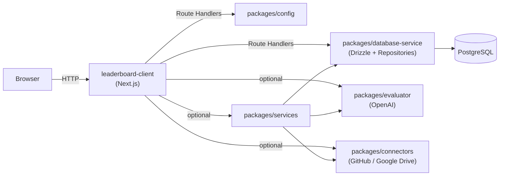
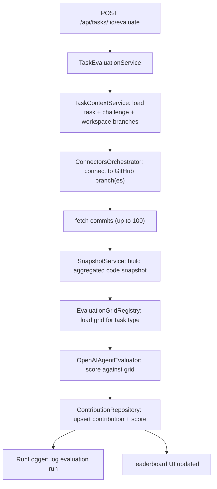
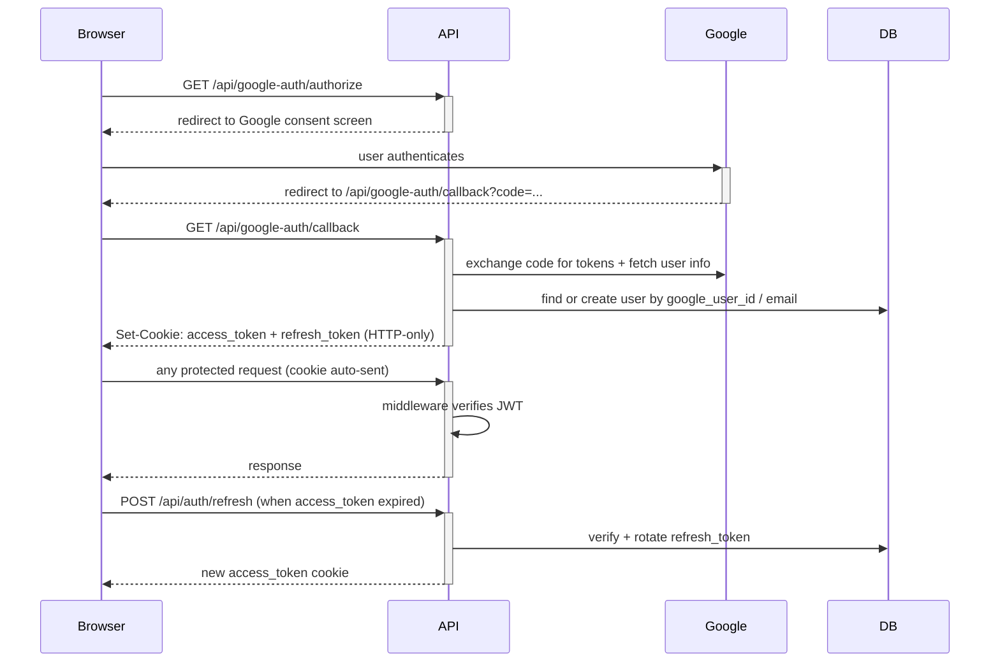
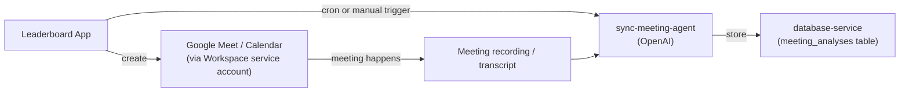

# Architecture

## Repository layout

This is a monorepo managed with npm workspaces. It has two top-level zones:

- **`apps/`** — deployable applications
- **`packages/`** — shared libraries consumed by apps and each other

```
leaderboard/
├── apps/
│   └── leaderboard-client/   ← Next.js app (the only deployed app)
└── packages/
    ├── config/               ← env validation (required by all)
    ├── database-service/     ← Drizzle ORM + repositories (required by all)
    ├── evaluator/            ← AI scoring pipeline (optional)
    ├── connectors/           ← GitHub + Google Drive (optional)
    ├── services/             ← orchestration logic (optional)
    ├── provisioner/          ← workspace provisioning (optional)
    ├── sync-meeting-agent/   ← meeting AI analysis (optional)
    └── test/                 ← ad-hoc test scripts
```

## How the pieces connect

The Next.js app is the single entry point for both the UI and the server-side logic. There is no separate API server — everything runs inside Next.js Route Handlers.


```mermaid
flowchart LR
  Browser -->|HTTP| NextApp["leaderboard-client\n(Next.js)"]
  NextApp -->|Route Handlers| Config["packages/config"]
  NextApp -->|Route Handlers| DB["packages/database-service\n(Drizzle + Repositories)"]
  DB --> Postgres[(PostgreSQL)]
  NextApp -->|optional| Services["packages/services"]
  NextApp -->|optional| Evaluator["packages/evaluator\n(OpenAI)"]
  NextApp -->|optional| Connectors["packages/connectors\n(GitHub / Google Drive)"]
  Services --> Evaluator
  Services --> Connectors
  Services --> DB
```

**Required at runtime:** `config` + `database-service`
**Optional (need API keys):** `evaluator`, `connectors`, `services`, `provisioner`, `sync-meeting-agent`

## Data flow — task evaluation pipeline

Evaluation is **task-scoped**: one contributor, one task, one evaluation run. The contributor and task are already known so there is no identification or deduplication step.


```mermaid
flowchart TD
  A["POST /api/tasks/:id/evaluate"] --> B["TaskEvaluationService"]
  B --> C["TaskContextService: load task + challenge + workspace branches"]
  C --> D["ConnectorsOrchestrator: connect to GitHub branch(es)"]
  D --> E["fetch commits (up to 100)"]
  E --> F["SnapshotService: build aggregated code snapshot"]
  F --> G["EvaluationGridRegistry: load grid for task type"]
  G --> H["OpenAIAgentEvaluator: score against grid"]
  H --> I["ContributionRepository: upsert contribution + score"]
  I --> J["RunLogger: log evaluation run"]
  I --> K["leaderboard UI updated"]
```

> The codebase still contains `sync-evaluation.service.ts` and the `identify` / `merge` agents from the old challenge-level pipeline — these are **no longer used**.

## Authentication flow

Login is via **Google OAuth** — there is no password login. After Google verifies the user, the app issues its own JWT cookies for all subsequent requests.


```mermaid
sequenceDiagram
  Browser->>+API: GET /api/google-auth/authorize
  API-->>-Browser: redirect to Google consent screen
  Browser->>+Google: user authenticates
  Google-->>-Browser: redirect to /api/google-auth/callback?code=...
  Browser->>+API: GET /api/google-auth/callback
  API->>Google: exchange code for tokens + fetch user info
  API->>DB: find or create user by google_user_id / email
  API-->>-Browser: Set-Cookie: access_token + refresh_token (HTTP-only)
  Browser->>+API: any protected request (cookie auto-sent)
  API->>API: middleware verifies JWT
  API-->>-Browser: response
  Browser->>+API: POST /api/auth/refresh (when access_token expired)
  API->>DB: verify + rotate refresh_token
  API-->>-Browser: new access_token cookie
```

## Sync meeting flow


```mermaid
flowchart LR
  App["Leaderboard App"] -->|create| Meet["Google Meet / Calendar\n(via Workspace service account)"]
  Meet -->|meeting happens| Recording["Meeting recording / transcript"]
  App -->|cron or manual trigger| Agent["sync-meeting-agent\n(OpenAI)"]
  Recording --> Agent
  Agent -->|store| DB["database-service\n(meeting_analyses table)"]
```

## Key design decisions

- **No separate API server.** All backend logic lives in Next.js Route Handlers. This simplifies deployment to a single PM2 process.
- **Optional packages.** The evaluator, connectors, services, and provisioner are all opt-in. The app runs fine with only `config` + `database-service`. This is why there are two prod modes (`prod:full` vs `prod:min`).
- **Drizzle over raw SQL.** The schema is defined in TypeScript (`packages/database-service/db/drizzle.ts`) and pushed to Postgres with `npm run db:push`. Migrations are generated but the primary workflow is schema-push in development.
- **Tasks as the unit of work — for code challenges.** Challenges are containers; tasks are where the actual work happens. The old challenge service is no longer used.
- **Two reward pipelines, split by challenge type.** `type: 'code'` challenges use the task-evaluation pipeline above and split a fixed pool proportionally at close. `type: 'ml'` challenges have no tasks — contributors submit datasets/models/packaging directly, scored and rewarded live, point by point. See [`ml-rewards.md`](./ml-rewards.md).
- **Project managers instead of a third role.** Rather than adding a `manager` value to `users.role`, elevated per-project access is modeled as a nullable FK (`projects.manager_id`). Role-based checks stay binary (`admin` / `contributor`); manager checks are a separate, project-scoped lookup. See [`auth.md`](./auth.md#project-managers-not-a-role).
