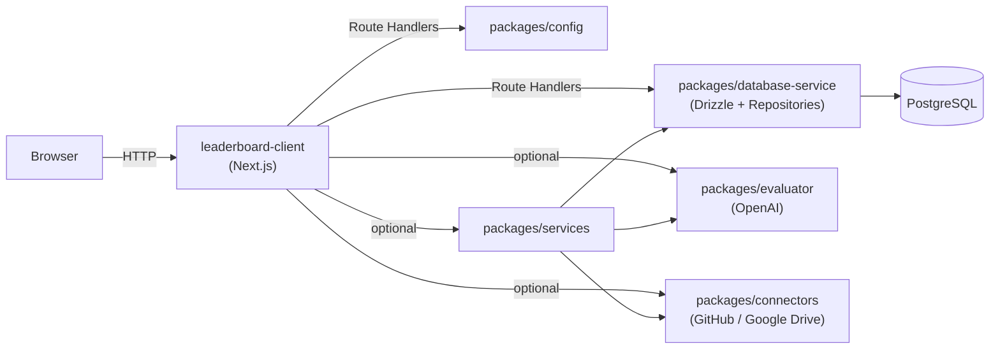
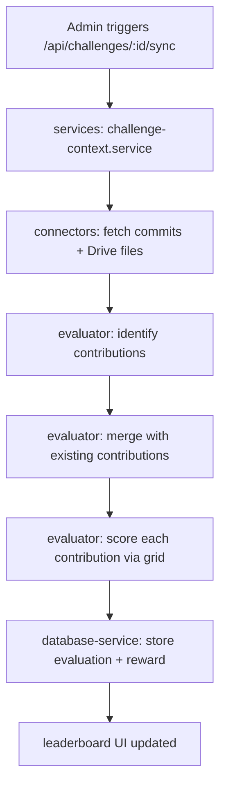
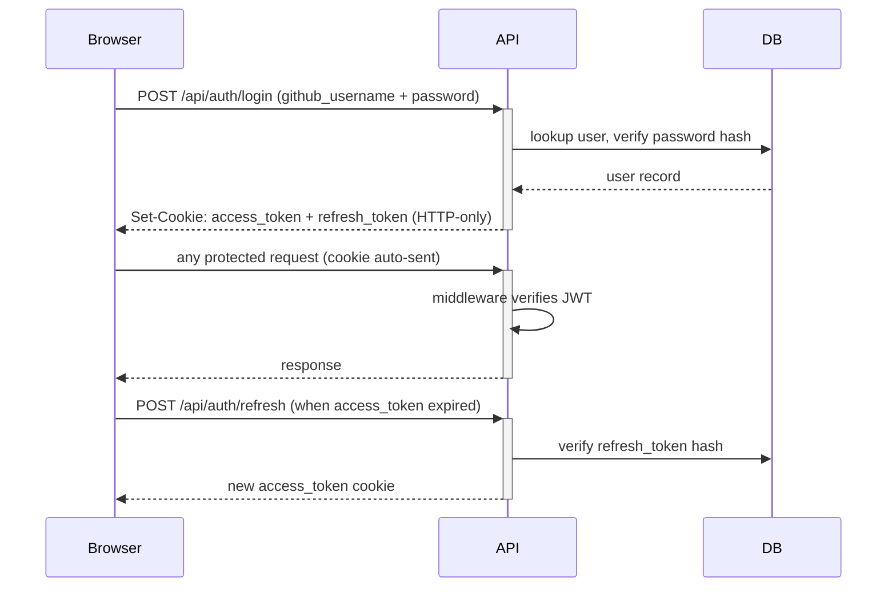
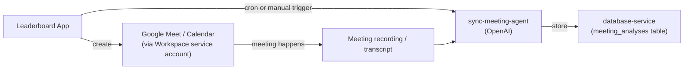

# Architecture

## Repository layout

This is a monorepo managed with npm workspaces. It has two top-level zones:

- **`apps/`** — deployable applications
- **`packages/`** — shared libraries consumed by apps and each other

```
leaderboard/
├── apps/
│   └── leaderboard-client/   ← Next.js app (the only deployed app)
└── packages/
    ├── config/               ← env validation (required by all)
    ├── database-service/     ← Drizzle ORM + repositories (required by all)
    ├── evaluator/            ← AI scoring pipeline (optional)
    ├── connectors/           ← GitHub + Google Drive (optional)
    ├── services/             ← orchestration logic (optional)
    ├── provisioner/          ← workspace provisioning (optional)
    ├── sync-meeting-agent/   ← meeting AI analysis (optional)
    └── test/                 ← ad-hoc test scripts
```

## How the pieces connect

The Next.js app is the single entry point for both the UI and the server-side logic. There is no separate API server — everything runs inside Next.js Route Handlers.


```mermaid
flowchart LR
  Browser -->|HTTP| NextApp["leaderboard-client\n(Next.js)"]
  NextApp -->|Route Handlers| Config["packages/config"]
  NextApp -->|Route Handlers| DB["packages/database-service\n(Drizzle + Repositories)"]
  DB --> Postgres[(PostgreSQL)]
  NextApp -->|optional| Services["packages/services"]
  NextApp -->|optional| Evaluator["packages/evaluator\n(OpenAI)"]
  NextApp -->|optional| Connectors["packages/connectors\n(GitHub / Google Drive)"]
  Services --> Evaluator
  Services --> Connectors
  Services --> DB
```

**Required at runtime:** `config` + `database-service`
**Optional (need API keys):** `evaluator`, `connectors`, `services`, `provisioner`, `sync-meeting-agent`

## Data flow — full evaluation pipeline

When evaluation is enabled, the flow from challenge sync to leaderboard update looks like this:


```mermaid
flowchart TD
  A["Admin triggers /api/challenges/:id/sync"] --> B["services: challenge-context.service"]
  B --> C["connectors: fetch commits + Drive files"]
  C --> D["evaluator: identify contributions"]
  D --> E["evaluator: merge with existing contributions"]
  E --> F["evaluator: score each contribution via grid"]
  F --> G["database-service: store evaluation + reward"]
  G --> H["leaderboard UI updated"]
```

## Authentication flow


```mermaid
sequenceDiagram
  Browser->>+API: POST /api/auth/login (github_username + password)
  API->>DB: lookup user, verify password hash
  DB-->>API: user record
  API-->>-Browser: Set-Cookie: access_token + refresh_token (HTTP-only)
  Browser->>+API: any protected request (cookie auto-sent)
  API->>API: middleware verifies JWT
  API-->>-Browser: response
  Browser->>+API: POST /api/auth/refresh (when access_token expired)
  API->>DB: verify refresh_token hash
  API-->>-Browser: new access_token cookie
```

## Sync meeting flow


```mermaid
flowchart LR
  App["Leaderboard App"] -->|create| Meet["Google Meet / Calendar\n(via Workspace service account)"]
  Meet -->|meeting happens| Recording["Meeting recording / transcript"]
  App -->|cron or manual trigger| Agent["sync-meeting-agent\n(OpenAI)"]
  Recording --> Agent
  Agent -->|store| DB["database-service\n(meeting_analyses table)"]
```

## Key design decisions

- **No separate API server.** All backend logic lives in Next.js Route Handlers. This simplifies deployment to a single PM2 process.
- **Optional packages.** The evaluator, connectors, services, and provisioner are all opt-in. The app runs fine with only `config` + `database-service`. This is why there are two prod modes (`prod:full` vs `prod:min`).
- **Drizzle over raw SQL.** The schema is defined in TypeScript (`packages/database-service/db/drizzle.ts`) and pushed to Postgres with `npm run db:push`. Migrations are generated but the primary workflow is schema-push in development.
- **Tasks as the unit of work.** Challenges are containers; tasks are where the actual work happens. The old challenge service is no longer used.
