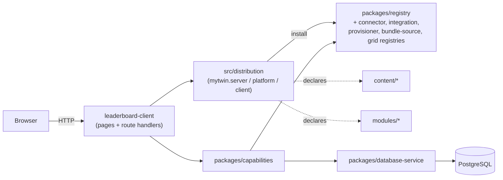
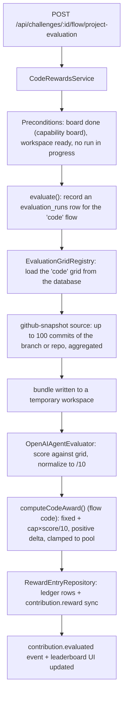
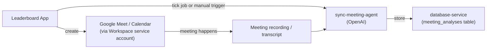

# Architecture

## Repository layout

This is a monorepo managed with npm workspaces. The code is split by **nature**, not by feature (challenge 020):

- **`packages/`** — the **core**: identity, structure, economy, capabilities and the registries. It knows no flow, connector or module by name.
- **`content/`** — **installed content**: challenge flows, the kits they share, extensions, connectors, bundle sources, workspace providers and grid seeds.
- **`modules/`** — **product modules** an admin can switch on and off: meetings, onboarding, digest, sandbox.
- **`apps/leaderboard-client/`** — the **shell** (Next.js pages, routes, UI) and the **distribution** (`src/distribution/`), the manifest that assembles core, content and modules for MyTwin.

```
leaderboard/
├── apps/
│   └── leaderboard-client/        ← Next.js app (the only deployed app)
│       └── src/distribution/      ← composition root: what MyTwin installs
├── packages/                      ← CORE
│   ├── registry/                  ← PlatformRegistry (flows, extensions, kits, modules, events, quests…)
│   ├── capabilities/              ← evaluate, bundle, board, groups, qualifications, pool/economy,
│   │                                 challenge actions + hooks, cron, events, modules, crypto,
│   │                                 credentials, identity (Google login), http-proxy (SSRF guard)
│   ├── config/                    ← env validation + credential getters
│   ├── database-service/          ← Drizzle schema + repositories
│   ├── evaluator/                 ← OpenAI scoring agent + grid registry
│   ├── connectors/                ← connector and integration interfaces + registries
│   ├── provisioner/               ← provider interface + registry
│   ├── services/                  ← not yet sorted: service code of flows and modules
│   ├── sync-meeting-agent/        ← not yet sorted: meeting AI analysis
│   └── slack-signal-agent/        ← not yet sorted: Slack signal detection
├── content/
│   ├── flows/                     ← code, ml, endpoint-validation, journey-validation
│   ├── kits/validation/           ← shared by the two validation flows
│   ├── extensions/                ← slack-signals (all flows), compute (+ Scaleway client, ML)
│   ├── connectors/                ← github, kaggle, slack
│   ├── integrations/openai/
│   ├── bundle-sources/            ← github-snapshot, kaggle-artifact
│   ├── workspace-providers/       ← github-branch
│   └── grids/                     ← code, model, dataset (seeds)
└── modules/                       ← meetings, onboarding, digest, sandbox
```

To add a challenge flow without touching the core, see [`writing-a-flow.md`](./writing-a-flow.md).

## Import boundaries

`packages/registry/architecture.test.ts` walks every import and fails on a crossing:

| From | May import |
|------|-----------|
| core (`packages/*`) | the core only |
| content (`content/<kind>/<name>`) | itself, a kit (`content/kits/*`), the core, unsorted code — never another flow, connector or provider |
| module (`modules/<name>`) | itself and the core — no content, no other module, no shell |
| shell (the app outside `src/distribution`) | the core; content and modules **only through `src/distribution/*`** |
| unsorted (`packages/services/`, `packages/slack-signal-agent/`, `packages/sync-meeting-agent/`) | anything but modules, distribution and shell |

`packages/registry/empty-distribution.test.ts` boots the core with nothing installed, and `packages/registry/example-flow.test.ts` installs a flow the core has never seen.

## How the pieces connect

The Next.js app is the single entry point for both the UI and the server-side logic. There is no separate API server. At startup, `src/instrumentation.ts` installs the distribution (`distribution/mytwin.server.ts`), which fills the core registries; the core then reads **what is installed** rather than branching on `challenges.type`.


```mermaid
flowchart LR
  Browser -->|HTTP| Shell["leaderboard-client\n(pages + route handlers)"]
  Shell --> Dist["src/distribution\n(mytwin.server / platform / client)"]
  Dist -->|install| Registry["packages/registry\n+ connector, integration,\nprovisioner, bundle-source, grid registries"]
  Dist -.declares.-> Content["content/*"]
  Dist -.declares.-> Modules["modules/*"]
  Shell --> Caps["packages/capabilities"]
  Caps --> Registry
  Caps --> DB["packages/database-service"]
  DB --> Postgres[(PostgreSQL)]
```

| Contract | Declared by | Read through |
|----------|-------------|--------------|
| Flow (`FlowDefinition`: descriptor, `flow_config` schema, rules, rule keys, contribution types, deliverables, hooks, actions, events, quests, proposable) | `content/flows/*` | `PlatformRegistry` |
| Extension (compatible flows, actions, hooks) | `content/extensions/*` | `PlatformRegistry` |
| Module (settings, jobs, events, subscriptions, `questRecorder`, `cpSource`) | `modules/*` | `PlatformRegistry` + capability `modules` |
| Connector, integration, bundle source, provider, grid | `content/*` | their own core registry |
| Client slots (tabs, form sections, rules view, hero stat, activity) | `distribution/mytwin.client.tsx`, `mytwin.forms.tsx`, `mytwin.activity.tsx` | `lib/flowSlots.ts`, `lib/flowFormSlots.ts` |
| Module slots (challenge section, admin nav and tab, public nav) | `distribution/mytwin.modules.tsx` | `lib/moduleSlots.ts` |

### Generic routes

| Route | Role |
|-------|------|
| `/api/challenges/[id]/flow/[...action]` | a flow action; each action declares its access (`roles`, `manager`, `member`, `qualification`) and the core dispatcher (`packages/capabilities/challenge-actions.ts`) enforces it |
| `/api/challenges/[id]/ext/[key]/[...action]` | same, for an extension attached to the challenge's flow |
| `/api/integrations`, `/api/integrations/[key]/{connection,status,authorize,callback,extras/[action]}` | admin connections, secrets in `integration_credentials` (capabilities `crypto` + `credentials`) |
| `/api/cron/tick` | the only scheduled entry point: runs the due jobs of the core, flows, extensions and enabled modules (`cron_runs`) |
| `/api/modules`, `/api/modules/[key]` | module list and state (public); settings and toggle (admin) |
| `/api/events/ui` | the few events only the browser sees (`ui.*`), written to the outbox under the session's user |

A disabled module answers 404 on its routes and pages, its jobs are skipped, its subscriptions consume nothing and its slots are hidden. Events go through an outbox (`platform_events`, cursors in `event_deliveries`), distributed by the tick.

> The five former cron routes (`/api/cron/{check-meetings,slack-signals,compute-provisioning,compute-expiration,digest}`) remain as thin wrappers until the Scalingo Scheduler points at `/api/cron/tick` only.

## Data flow — code project evaluation pipeline

Evaluation is **project-scoped**: a contributor's personal task board is purely organizational and never scored directly. Once all of a contributor's tasks are `done` and their workspace is ready, they trigger one evaluation of their whole delivery.


```mermaid
flowchart TD
  A["POST /api/challenges/:id/flow/project-evaluation"] --> B["CodeRewardsService"]
  B --> C["Preconditions: board done (capability board), workspace ready, no run in progress"]
  C --> D["evaluate(): record an evaluation_runs row for the 'code' flow"]
  D --> E["EvaluationGridRegistry: load the 'code' grid from the database"]
  E --> F["github-snapshot source: up to 100 commits of the branch or repo, aggregated"]
  F --> G["bundle written to a temporary workspace"]
  G --> H["OpenAIAgentEvaluator: score against grid, normalize to /10"]
  H --> I["computeCodeAward() (flow code): fixed + cap×score/10, positive delta, clamped to pool"]
  I --> J["RewardEntryRepository: ledger rows + contribution.reward sync"]
  J --> K["contribution.evaluated event + leaderboard UI updated"]
```

## Authentication flow

Login is via **Google OAuth** (`packages/capabilities/identity/google-auth.ts`) — there is no password login. After Google verifies the user, the app issues its own JWT cookies for all subsequent requests.


```mermaid
sequenceDiagram
  Browser->>+API: GET /api/google-auth/authorize
  API-->>-Browser: redirect to Google consent screen
  Browser->>+Google: user authenticates
  Google-->>-Browser: redirect to /api/google-auth/callback?code=...
  Browser->>+API: GET /api/google-auth/callback
  API->>Google: exchange code for tokens + fetch user info
  API->>DB: find or create user by google_user_id / email (user.created event)
  API-->>-Browser: Set-Cookie: access_token + refresh_token (HTTP-only)
  Browser->>+API: any protected request (cookie auto-sent)
  API->>API: proxy verifies JWT
  API-->>-Browser: response
  Browser->>+API: POST /api/auth/refresh (when access_token expired)
  API->>DB: verify + rotate refresh_token
  API-->>-Browser: new access_token cookie
```

## Sync meeting flow

Meetings are the `meetings` module (off by default).


```mermaid
flowchart LR
  App["Leaderboard App"] -->|create| Meet["Google Meet / Calendar\n(via Workspace service account)"]
  Meet -->|meeting happens| Recording["Meeting recording / transcript"]
  App -->|tick job or manual trigger| Agent["sync-meeting-agent\n(OpenAI)"]
  Recording --> Agent
  Agent -->|store| DB["database-service\n(meeting_analyses table)"]
```

## Key design decisions

- **No separate API server.** All backend logic lives in Next.js Route Handlers. This simplifies deployment to a single process.
- **The core never names a flow.** Everything that depends on a challenge's kind — config, rules, actions, hooks, UI — is declared by the flow and read from the registries. `challenges.flow_config` (jsonb) is validated by the flow's schema; `reward_rules` stays a separate, editable column parsed by the flow.
- **One composition root.** What is installed — flows, extensions, kits, modules, connectors, integrations, providers, grids — is declared in `apps/leaderboard-client/src/distribution/`, and the architecture test keeps the core free of content and module code.
- **Optional integrations.** Connectors, the evaluator and providers read their credentials from the store when called, so the app builds and runs without them; a feature whose credentials are missing is simply unavailable.
- **Drizzle schema, idempotent apply.** The schema is defined in TypeScript (`packages/database-service/db/drizzle.ts`); production applies it with `scripts/db-apply-schema.ts`, which also carries the data migrations. Old columns are kept until they are dropped after a verified deploy.
- **Three roles, and qualifications beside them.** `users.role` is `admin` / `contributor` / `viewer`; being a qualified reviewer is a qualification (`user_qualifications`, e.g. `medical_pro` declared by the MyTwin distribution), required by the validation flows through their `flow_config`. See [`auth.md`](./auth.md#roles).
- **Tasks as a personal board — a core capability.** A flow opts into the board (`uses.board`) and groups (`uses.groups`); the code flow uses board completion as the precondition of its evaluation.
- **Group work is an indirection, not a second ownership axis.** A group shares one workspace; `resolveWorkspaceOwner()` maps a caller to the member who holds it, so every query keeps operating on a plain `user_id`. See [`challenge-groups.md`](./challenge-groups.md).
- **A sandbox is not a challenge.** Contributor proposals live in their own tables with their own CP ledger (`sandbox_rewards`), declared as a CP source (`PlatformRegistry.cpSources()`) rather than injected by hand into the leaderboard. Which kinds of proposal exist is decided by the flows that declare `proposable`. See [`sandbox.md`](./sandbox.md).
- **One reward philosophy, flow-owned math.** Flows declare their rule keys and whether each consumes the pool; the core computes the remainder, completion and resync alone. See [`ml-rewards.md`](./ml-rewards.md).
- **The digest table is its own cursor.** A digest's `period_start` always equals the previous one's `period_end`, so two consecutive digests can neither gap nor overlap. Its payload is denormalized and never rewritten. See [`digest.md`](./digest.md).
- **Project managers instead of a fourth role.** Elevated per-project access is modeled as a nullable FK (`projects.manager_id`), checked separately from roles. See [`auth.md`](./auth.md#project-managers-not-a-role).
