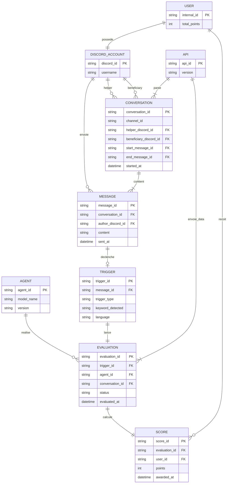

# Séance 6 — Ydays

## Diagramme ERD

---

## Notes d'architecture

- **`CONVERSATION`** porte `helper_discord_id` et `beneficiary_discord_id` pour identifier les deux rôles, avec `start_message_id` / `end_message_id` pour délimiter l'historique
- **`TRIGGER`** porte `trigger_type` (`GRATITUDE` ou `HELP_REQUEST`), `keyword_detected` et `language` (`FR` / `EN`)

---

## Mots-clés de déclenchement

### `GRATITUDE` — récompense le helper

| FR | EN |
|---|---|
| merci | thank you |
| je te remercie | thanks |
| grand merci | thx |
| mille mercis | ty |
| je vous remercie | many thanks |
| un grand merci | appreciate it |
| trop sympa | much appreciated |
| c'est gentil | cheers |
| je suis reconnaissant(e) | I owe you one |
| t'es un chef | you're a lifesaver |

### `HELP_REQUEST` — délimite le début de conversation

| FR | EN |
|---|---|
| j'ai un problème | I have a problem / issue |
| je n'arrive pas à | I can't / I'm unable to |
| comment faire | how to / how do I |
| pourquoi ça ne marche pas | why doesn't it work |
| besoin d'aide | need help |
| quelqu'un peut m'aider | can someone help me |
| je comprends pas | I don't understand |
| ça bug | it's broken / it's not working |
| est-ce que c'est normal | is it supposed to |
| j'ai une question | I have a question |

> **Note :** La détection se fait par correspondance de mots-clés sur le champ `content` de `MESSAGE`, avec `language` inféré (FR/EN) pour adapter la liste.
